# CI/CD 실습 순서


<br />

공인 IP로 SSH 접속
```bash
ssh root@[공인IP]
```

## 1. NKS Authentication 등록

### NCP IAM 인증이란?
NKS 클러스터에 `kubectl`로 접근하기 위해 필요한 인증 과정(마스터 노드 접근)
- `kubectl` : 쿠버네티스를 조작하는 명령어 도구(Command Line Tool)이다.

### 1) ncp-iam-authenticator 설치
#### ncp-iam-authenticator 다운로드
```bash
curl -o ncp-iam-authenticator -L https://github.com/NaverCloudPlatform/ncp-iam-authenticator/releases/latest/download/ncp-iam-authenticator_linux_amd64
```
#### 바이너리 실행 권한 추가
```bash
chmod +x ./ncp-iam-authenticator
```
#### `$HOME/bin/ncp-iam-authenticator`를 생성하고 PATH에 추가
```bash
mkdir -p $HOME/bin && cp ./ncp-iam-authenticator $HOME/bin/ncp-iam-authenticator && export PATH=$PATH:$HOME/bin
```
#### Shell Profile에 PATH 추가
```bash
echo 'export PATH=$PATH:$HOME/bin' >> ~/.bash_profile
```
#### 상태 확인
```bash
ncp-iam-authenticator help
```

### 2)IAM 인증 kubeconfig 생성
#### OS 환경 변수 설정 (엑셀 참고)
```bash
export NCLOUD_ACCESS_KEY=
export NCLOUD_SECRET_KEY=
export NCLOUD_API_GW=https://ncloud.apigw.gov-ntruss.com
```
#### configure 파일 생성 (엑셀 참고)
```bash
cd ~/.ncloud
```
```bash
vi ~/.ncloud/configure

[DEFAULT]
ncloud_access_key_id = 
ncloud_secret_access_key = 
ncloud_api_url = 

[project]
ncloud_access_key_id = 
ncloud_secret_access_key = 
ncloud_api_url = 
```
#### kubeconfig 생성 (엑셀 참고)
```bash
ncp-iam-authenticator create-kubeconfig --region KR --clusterUuid <클러스터uuid> --output kubeconfig.yaml
```
#### 클러스터 확인
```bash
kubectl get nodes --kubeconfig=/root/.ncloud/kubeconfig.yaml
```

### 3) alias 등록
```bash
alias k='kubectl --kubeconfig=/root/.ncloud/kubeconfig.yaml'
```
#### config.toml 수정

containerd가 기본적으로 HTTPS만 신뢰해서 HTTP 접근 허용해주는 작업

```bash
vi /etc/containerd/config.toml
```
```bash
[plugins."io.containerd.grpc.v1.cri".registry.mirrors."<공인IP>:30500"]
endpoint = ["http://<공인IP>:30500"]
```
```bash
systemctl restart containerd
```

<br /><br />

## 2. Jenkins 생성

### Jenkins란?

코드를 빌드하고 테스트해서 애플리케이션을 만들 수 있도록 도와주는 자동화 도구이다.

### 0) Namespace 생성

#### Namespace란?

쿠버네티스 리소스를 목적이나 팀별로 구분해서 관리할 수 있게 해주는 공간이다.

```bash
k create namespace jenkins
```
jenkins manifest 파일을 모을 폴더 생성

```bash
mkdir -p ~/manifest/jenkins
```
```bash
cd ~/manifest/jenkins
```

<br />

### 1) PersistentVolumeClaim 생성

<br />

**PVC란?**

Pod가 필요로 하는 저장소를 요청하는 요청서입니다.

StorageClass를 참고하여 실제 볼륨이 생성됩니다.

<br />

**Pod**란?

Pod는 쿠버네티스에서 컨테이너가 실행되는 기본 단위입니다.

컨테이너는 항상 Pod 안에서 실행되며, 보통 컨테이너 1개 = Pod 1개로 구성됩니다.

<br />

**Storage Class**란?

쿠버네티스가 볼륨(PV)을 자동으로 만들 때 참고하는 "템플릿" 입니다.

<br />

**PV**란?

쿠버네티스 클러스터에서 미리 만들어진 실제 저장소 공간입니다.

<br />

```bash
vi pvc.yaml
```

```yaml
apiVersion: v1
kind: PersistentVolumeClaim
metadata:
  name: jenkins-pvc                      # PVC 이름
  namespace: jenkins                     # PVC가 속할 네임스페이스
spec:
  accessModes:
    - ReadWriteOnce                      # 하나의 노드에서 읽기/쓰기 가능
  storageClassName: nks-block-storage    # 사용할 StorageClass 이름
  resources:
    requests:
      storage: 10Gi                      # 요청할 저장공간 용량(10GiB)
```

```bash
k apply -f pvc.yaml
```

<br />

### 3) Deployment 생성

<br />

**Deployment**란?

애플리케이션을 몇 개의 Pod로 실행할지, 언제 재시작할지 등을 정의하는 실행 관리 설정입니다.

애플리케이션을 안정적으로 배포하고 운영하기 위한 핵심 구성 요소입니다.

<br />

```bash
vi deploy.yaml
```

```yaml
apiVersion: apps/v1
kind: Deployment
metadata:
  labels:
    app: jenkins
  name: jenkins
  namespace: jenkins
spec:
  replicas: 1                # Pod 수 1개 실행  
  selector:
    matchLabels:
      app: jenkins
  template:
    metadata:
      labels:
        app: jenkins
    spec:
      securityContext:
        fsGroup: 1000
      containers:
      - image: kbsys9505/jenkins:2.492-jdk17
        imagePullPolicy: Always
        name: jenkins
        ports:
        - containerPort: 8080
          protocol: TCP
        - containerPort: 50000
          protocol: TCP
        resources:
          limits:
            cpu: 4
            memory: 8Gi
          requests:
            cpu: 2
            memory: 4Gi
        securityContext:
          privileged: true
        volumeMounts:                  
        - name: jenkins-home
          mountPath: /var/jenkins_home    # 이 경로에 데이터를 저장함
      volumes:
      - name: jenkins-home
        persistentVolumeClaim:
          claimName: jenkins-pvc
```

```bash
k apply -f deploy.yaml
```

```bash
root@ehyang-w-3c0c:~/manifest/jenkins# k get deploy -n jenkins
NAME      READY   UP-TO-DATE   AVAILABLE   AGE
jenkins   0/1     1            0           28s
```

<br />

### 4) Service 생성

<br />

**Service**란?

쿠버네티스에서 Pod에 안정적으로 접근할 수 있도록 IP와 포트를 제공해주는 네트워크 설정입니다.

외부 또는 클러스터 내부에서 애플리케이션에 접근할 때 사용됩니다.

<br />

```bash
vi svc.yaml
```

```yaml
apiVersion: v1
kind: Service
metadata:
  name: jenkins-svc
  namespace: jenkins
  labels:
    app: jenkins
spec:
  type: NodePort            # 외부에서 접근 가능한 NodePort 타입 서비스
  ports:
  - port: 8080
    targetPort: 8080
    nodePort: 30080         # 외부에서 접근할 포트번호
    name: jenkins-web
  selector:
    app: jenkins
```

<br />

**NodePort**란?

쿠버네티스 바깥에서 특정 포트를 통해 앱에 접속할 수 있게 해주는 기능입니다.

<br />

```bash
k apply -f svc.yaml
```

<br />

```bash
k get svc -n jenkins
```

<br />

### 5) Jenkins 파일 업로드

- 젠킨스 tar 파일 다운로드
https://drive.google.com/file/d/17tQGNK_djcFC2CGWpVO-0QUkNtDw0PUU/view?usp=drive_link

- 파일 서버에 보내기
```bash
scp jenkins_home.tar.gz root@211.188.64.246:/root
```

- 파드 확인
```bash
k get pod -n jenkins
```

- 파일 파드에 보내기
```bash
k cp jenkins_home.tar.gz -n jenkins <pod명>:/var
```

- 파드 접근
```bash
k exec -it <pod명> -n jenkins -- bash
```

- 압축 해제
```bash
cd /var
```
```bash
tar -zxvf jenkins_home.tar.gz
```
```bash
cd jenkins_home
```
```bash
exit
```
- 파드 재실행
```bash
k get pod -n jenkins
```
```bash
k delete pod <파드이름> -n jenkins
```
삭제해도 자동으로 다시 생성

<br />
<br />

### 6) Jenkins 접속

### 접속 : [서버공인IP]:30080/

초기비밀번호 위치
/var/jenkins_home/secrets/initialAdminPassword

- ID : admin

- PW : clush1234

<br />
<br />

## 3. Nexus 생성

<br />

**Nexus**란?
빌드된 애플리케이션 이미지를 저장하고 관리하는 저장소 서버(이미지 창고)입니다.

<br />

### 0) Namespace 생성
```bash
k create namespace nexus
```

jenkins manifest 파일을 모을 폴더 생성
```bash
mkdir -p ~/manifest/nexus
```
```bash
cd ~/manifest/nexus
```

<br />

### 1) PersistentVolumeClaim 생성

<br />

```bash
vi pvc.yaml
```

```yaml
apiVersion: v1
kind: PersistentVolumeClaim
metadata:
  name: nexus-pvc                 # PVC 이름
  namespace: nexus                # PVC가 속할 네임스페이스
spec:
  accessModes:
    - ReadWriteOnce                        # 하나의 노드에서 읽기/쓰기 가능
  storageClassName: nks-block-storage      # 사용할 StorageClass 이름
  resources:
    requests:
      storage: 10Gi               # 요청할 저장공간 용량(10GiB)
```

```bash
k apply -f pvc.yaml
```

<br />

### 3) Deployment 생성

<br />

```bash
vi deploy.yaml
```

```yaml
apiVersion: apps/v1
kind: Deployment
metadata:
  labels:
    app: nexus
  name: nexus
  namespace: nexus
spec:
  replicas: 1
  selector:
    matchLabels:
      app: nexus
  template:
    metadata:
      labels:
        app: nexus
    spec:
      securityContext:
        fsGroup: 1000
      containers:
      - image: sonatype/nexus3:3.52.0
        imagePullPolicy: Always
        name: nexus
        ports:
        - containerPort: 8081
          protocol: TCP
          name: nexus-web
        - containerPort: 5000
          protocol: TCP
          name: nexus-docker
        resources:
          limits:
            cpu: 4
            memory: 8Gi
          requests:
            cpu: 2
            memory: 4Gi
        volumeMounts:
        - name: nexus-data
          mountPath: /nexus-data
      volumes:
      - name: nexus-data
        persistentVolumeClaim:
          claimName: nexus-pvc
```

```bash
k apply -f deploy.yaml
```

<br />

### 4) Service 생성

<br />

**Service**란?

쿠버네티스에서 Pod에 안정적으로 접근할 수 있도록 IP와 포트를 제공해주는 네트워크 설정입니다.

외부 또는 클러스터 내부에서 애플리케이션에 접근할 때 사용됩니다.

<br />

```bash
vi svc.yaml
```

```yaml
apiVersion: v1
kind: Service
metadata:
  name: nexus-svc
  namespace: nexus
  labels:
    app: nexus
spec:
  type: NodePort
  ports:
  - port: 80
    targetPort: 8081
    nodePort: 30081
    name: nexus-web
  - port: 5000
    targetPort: 5000
    nodePort: 30500
    name: nexus-docker
  selector:
    app: nexus
```

```bash
k apply -f svc.yaml
```

<br />

### 5) Nexus 접속

### 접속 : <서버공인IP>:30081

<br />

**초기 비밀번호 조회**

Pod 내부의 /nexus-data/admin.password에 위치

- Pod 조회
```bash
k get pod -n nexus
```
- Pod 접속
```bash
k exec -it <pod명> -n nexus -- /bin/bash 
```
- 폴더 이동
```bash
cd /nexus-data
```
- 파일 조회
```bash
ls -al
```
- 비밀번호 조회
```bash
cat admin.password; echo
```
ID : admin
PW : 초기 비밀번호

<br />
<br />

# 4. ArgoCD 생성

<br />

**ArgoCD**란?

Git 저장소와 쿠버네티스를 연결해, 코드 변경 내용을 자동으로 배포해주는 도구입니다.

<br />


### 0) Namespace 생성
```bash
k create namespace argocd
```

<br />

### 1) ArgoCD 배포
```bash
k apply -n argocd -f https://raw.githubusercontent.com/argoproj/argo-cd/stable/manifests/install.yaml
```

<br />

### 2) NodePort로 수정
```bash
k patch svc argocd-server -n argocd -p '{"spec":{"type":"NodePort","ports":[{"port":80,"targetPort":8080,"nodePort":30082}]}}'
```

<br />

### 3) ArgoCD 접속

### 접속 : <서버공인IP>:30082

ID : admin

<br />

**초기 비밀번호 조회**
```bash
k -n argocd get secret argocd-initial-admin-secret -o jsonpath="{.data.password}" | base64 -d; echo
```

<br />
<br />

## 5. Jenkins 비밀번호 변경
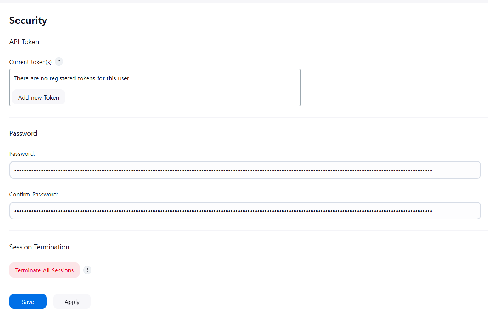

<br />
<br />

## 6. Jenkins Credential 생성
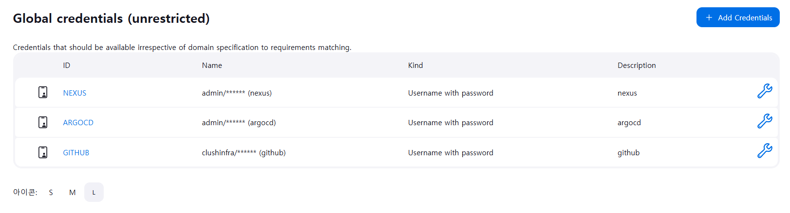

### Github
- Username : clushinfra
- Password : 입력
- ID : GITHUB

### Nexus
- Username : admin
- Password : 입력
- ID : NEXUS

### ArgoCD
- Username : admin
- Password : 입력
- ID : ARGOCD

<br />
<br />

## 7. Jenkins Job 생성

<br />

https://github.com/clushinfra/workshop-cicd/blob/main/Jenkinsfile

해당 Jenkins 파일을 사용해 파이프라인을 생성할 예정입니다.

<br />

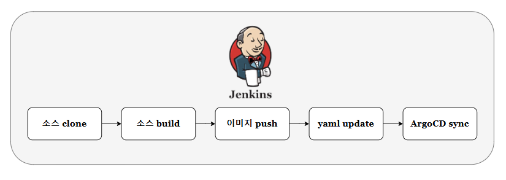

<br />

### 매개변수 등록
---
**1) SERVER_PUBLIC_IP**

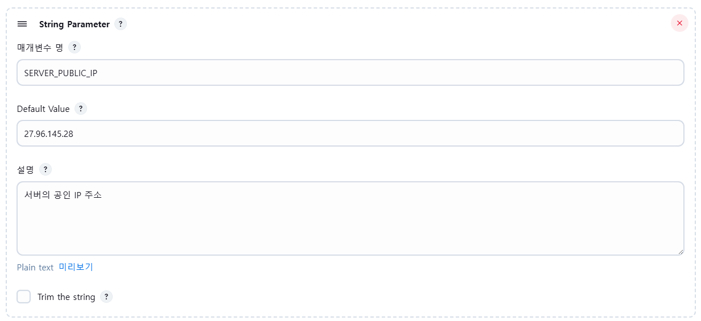

- 매개변수 명 : ```SERVER_PUBLIC_IP```
- Default Value : ```서버 공인 IP```
---
**2) SOURCE_GIT_URL**

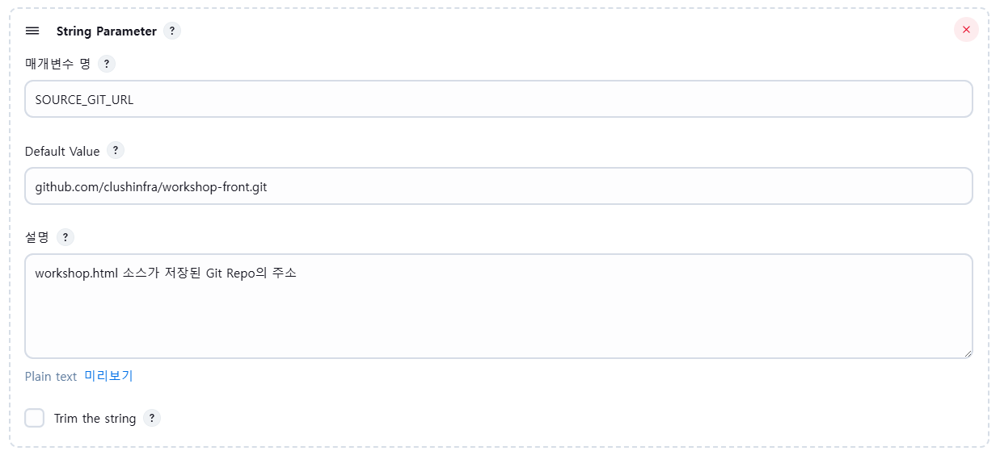

- 매개변수 명 : ```SOURCE_GIT_URL```
- Default Value : ```github.com/clushinfra/workshop-front.git```
---
**3) SOURCE_BRANCH**

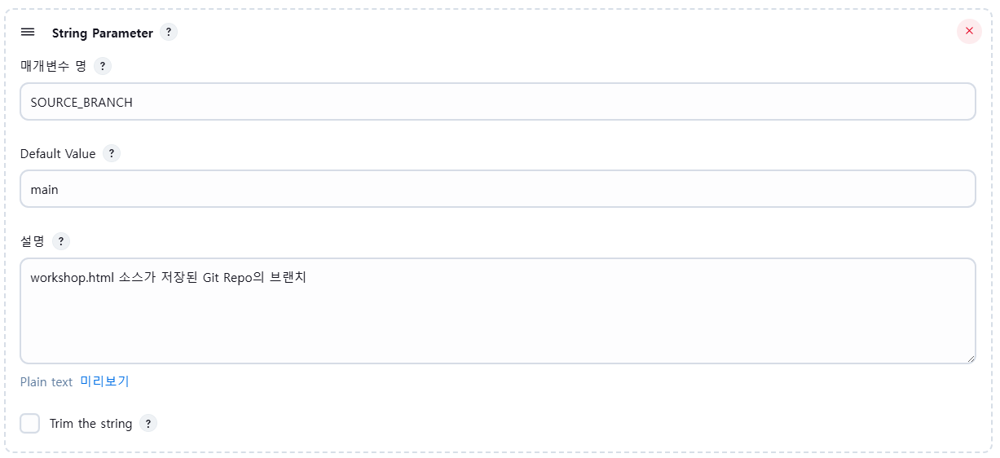

- 매개변수 명 : ```SOURCE_BRANCH```
- Default Value : ```main```
---
**4) CICD_GIT_URL**

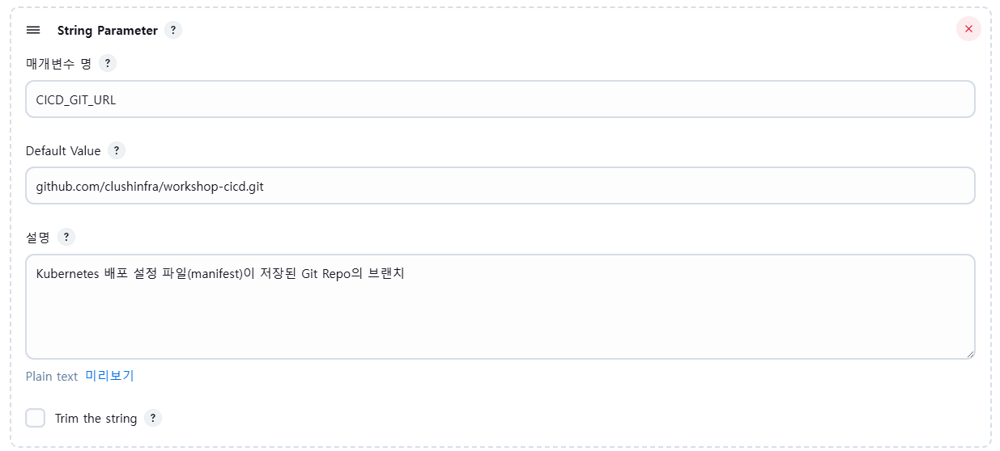

- 매개변수 명 : ```CICD_GIT_URL```
- Default Value : ```github.com/clushinfra/workshop-cicd.git```
---
**5) CICD_BRANCH**

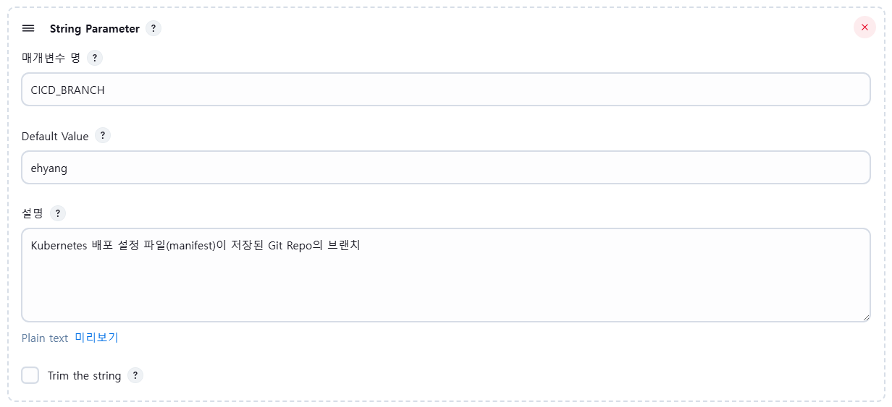

- 매개변수 명 : ```CICD_BRANCH```
- Default Value : ```메일 ID```
---
**6) DEPLOY_APP_NAME**

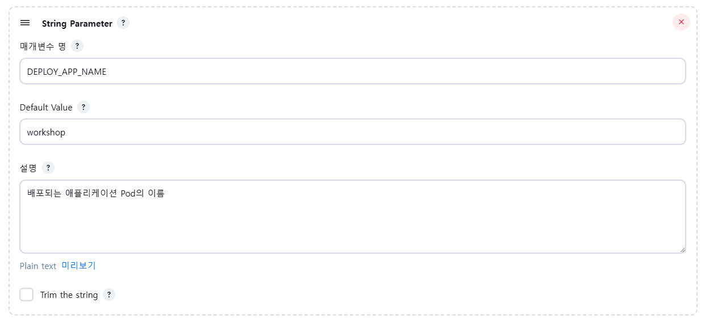

- 매개변수 명 : ```DEPLOY_APP_NAME```
- Default Value : ```workshop```
---
**7) NS**

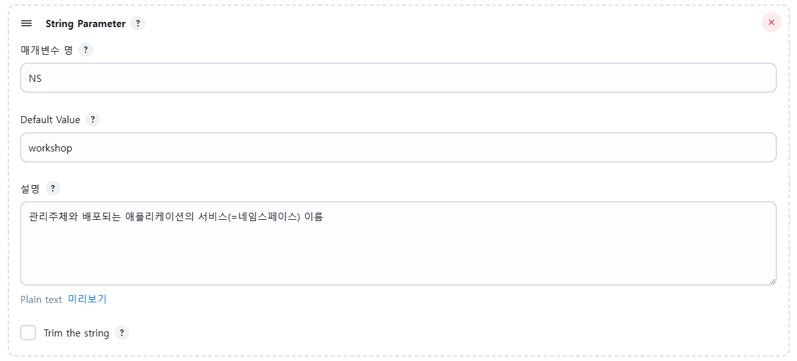

- 매개변수 명 : ```NS```
- Default Value : ```workshop```
---
**8) CLUSTER**

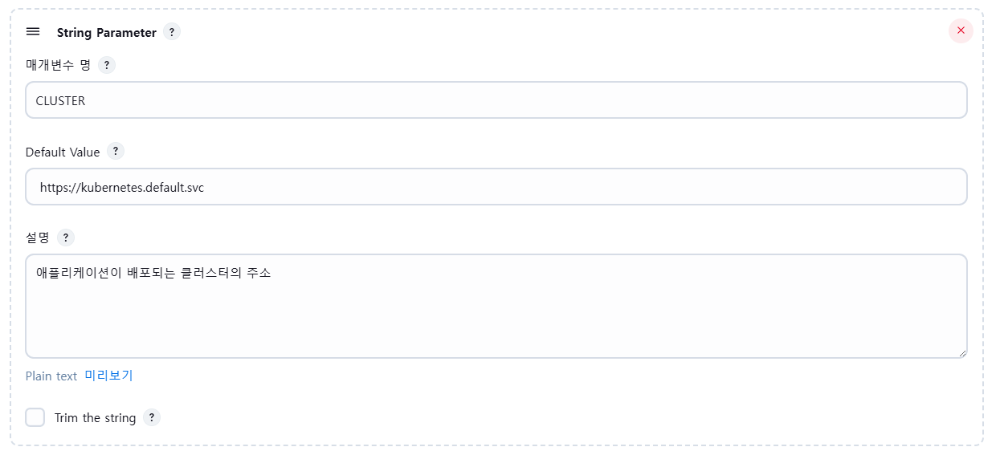

- 매개변수 명 : ```CLUSTER```
- Default Value : ```https://kubernetes.default.svc```
---
**9) DOCKER_BASE_IMAGE**

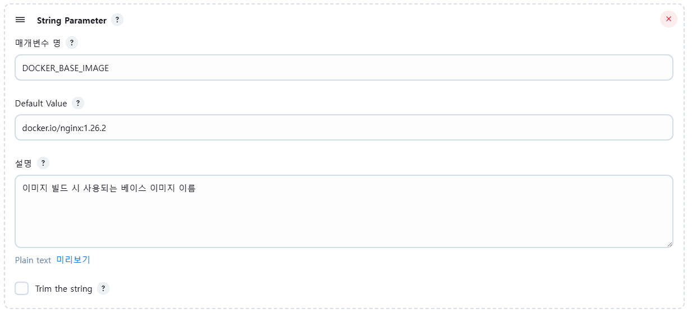

- 매개변수 명 : ```DOCKER_BASE_IMAGE```
- Default Value : ```docker.io/nginx:1.26.2```
---
**10) DOCKER_DEPLOY_PORT**

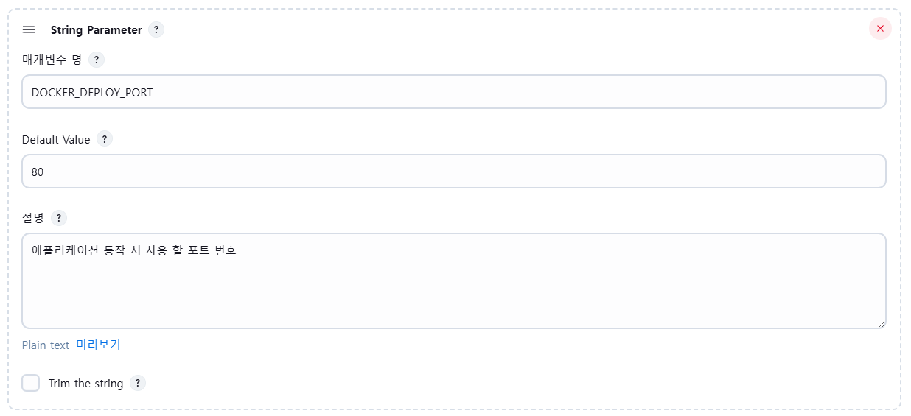

- 매개변수 명 : ```DOCKER_DEPLOY_PORT```
- Default Value : ```80```
---
### Pipeline 등록

- Repository URL : ```https://github.com/clushinfra/workshop-cicd.git```
- Credentials : ```github credential 사용```
- Branch : ```main```
- Script Path : ```Jenkinsfile```

<br />
<br />

## 8. 배포 확인

<br />

### 접속 : <서버공인IP>:31111

```bash
k get all -n workshop
```

<br />
<br />

## 5. 모니터링 진행

<br />

**Node Exporter**란?

서버의 상태 정보를 Prometheus가 가져갈 수 있게 만들어주는 프로그램

<br />

**Prometheus**란?

서버나 애플리케이션에서 나오는 정보를 모아서 저장하는 도구

<br />

**Grafana**란?

Prometheus가 수집한 데이터를 그래프나 대시보드로 시각화해 보여주는 도구

<br />

```bash
# config 생성
cp ~/.ncloud/kubeconfig.yaml ~/.kube/config

# helm 설치
curl https://raw.githubusercontent.com/helm/helm/main/scripts/get-helm-3 | bash

# 버전 확인
helm version

# repo 등록
helm repo add prometheus-community https://prometheus-community.github.io/helm-charts

# repo 업데이트
helm repo update

# namespace 생성
k create namespace monitoring

# config 생성
cp ~/.ncloud/kubeconfig.yaml ~/.kube/config

# 다운로드
helm install kube-prometheus-stack prometheus-community/kube-prometheus-stack   -n monitoring   --set prometheus.prometheusSpec.maximumStartupDurationSeconds=300

# 비밀번호 조회
k --namespace monitoring get secrets kube-prometheus-stack-grafana   -o jsonpath="{.data.admin-password}" | base64 -d && echo

# Grafana Pod의 이름을 자동으로 찾아서 POD_NAME이라는 변수에 저장하는 작업
export POD_NAME=$(kubectl -n monitoring get pod \
  -l "app.kubernetes.io/name=grafana,app.kubernetes.io/instance=kube-prometheus-stack" \
  -o name)
  
# NodePort로 변경
kubectl patch svc kube-prometheus-stack-grafana -n monitoring \
  -p '{"spec": {"type": "NodePort", "ports": [{"port": 80, "targetPort": 3000, "nodePort": 30083}]}}' 
```

## 접속 확인

### 접속 : <서버공인IP>:30083/

ID : admin

PW : 초기 비밀번호


<br /><br />

# 개념 정리

## 쿠버네티스란

- "컨테이너 오케스트레이션 시스템"
  - 컨테이너를 잘 운영해주는 플랫폼
  - Docker 컨테이너를 대량으로 안정적이고 자동화된 방식으로 운영하기 위한 시스템
- 장점
    1. 애플리케이션 배포 단순화
       - 쿠버네티스는 모든 워커 노드를 하나의 배포 플랫폼으로 제공하기 때문에 애플리케이션 개발자는 자체적으로 애플리케이션을 배포할 수 있으며 클러스터를 구성하는 서버에 관해 알 필요가 없어진다.
    2. 하드웨어 자원 활용도 향상
       - 쿠버네티스는 애플리케이션이 필요로 하는 리소스를 기준으로 가장 적합한 노드에 배치한다.   
       - 컨테이너들이 노드 간에 유연하게 이동하여 자원낭비를 최소화한다. 
       - 특히 클러스터가 커질수록 쿠버네티스의 리소스 스케줄링 능력이 더 유용해진다.
         - 리소스 스케줄링 : 애플리케이션(Pod)을 어느 노드(Node)에 띄울지 자동으로 스케줄 해주는 것.
         - 2~3대 서버의 작은 클러스터의 경우 사람이 보고 직접 결정 가능하다(CPU 많이 남은 서버에 띄우면 된다.)
         - 수십, 수백대 서버의 큰 클러스터는 사람이 일일이 확인이 불가능하다. <br />
           각각의 노드에 남은 CPU, 메모리, GPU 여부, 하드웨어 스펙 등이 다르고, 심지어 태그(label), Taint 조건도 다양하다.<br />
            이때 쿠버네티스는 :<br />
            Pod의 요청 리소스(`spec.resources.requests`)를 보고 적절한 Node를 자동 선택, 로드 밸런싱도 자동 고려<br />
            → 즉,, 사람보다 훨씬 빠르고 정확하게 "어디에 띄울지" 결정해준다.  
    3. 자가 치유(Self-Healing) 기능
       - 노드나 Pod가 죽으면 자동 복구
       - 운영자가 수동으로 재배포하지 않아도 됨
       - 예비 자원이 있으면 야간 장애에도 대응을 늦출 수 있음
       - 기본적으로 작동하고 따로 설정 필요없이 적용된다.
       - 언제 작동되는지?
         - Pod가 CrashLoopBackOff상태로 계속 죽을 떄
         - 노드가 죽었을 때(ex : 서버가 꺼졌을 때)
         - 컨테이너 내부에서 exit(1)등으로 비정상 종료됐을 떄
    4. 오토스케일링(자동 확장/축소)
       - 부하에 따라 Pod 수 자동 조철(HPA, VPA)
       - 클라우드 환경에서는 노드 수 자체도 자동 조절(Cluster Autoscaler)
    5. 개발 환경과 운영 환경 통일
       - 개발 환경과 운영 환경이 모두 컨테이너 기반으로 통일됨
       - 버그 재현이 쉬워지고 수정이 간편해짐
    6. 서비스 디스커버리 자동화
       - 쿠버네티스는 DNS 이름 기반 서비스 검색을 지원
       - 애플리케이션은 복잡한 피어 검색 로직 없이 환경 변수 또는 DNS로 서비스 접근 가능
    7. 배포 신뢰성 향성(자동 롤백)
       - 새 버전 배포 중 문제가 생기면 쿠버네티스가 자동으로 롤백
       - 개발자와 운영자의 신뢰감 향상, CI/CD 속도 증가
       - 단, 완전한 자동 롤백은 ArgoCD, Spinnaker 도구와 함께 사용해야 더 강력해진다.  
   
> 💡 Node, Container, Pod
> ```plain
> Node(서버)
>  └─ Pod(쿠버네티스가 관리하는 최소 단위)
>       └─ Container(Docker, containerd 등)
> ```
> |용어|설명|
> |--|--|
> |Node|실제 서버 혹은 가상 서버(ex: EC2, VM)|
> |Container|실행 중인 애플리케이션(도커 기반)|
> |Pod|컨테이너 1개 또는 여러 개를 묶은 쿠버네티스 단위<br />쿠버네티스가 직접 관리하는 최소 단위가 컨테이너가 아니라 Pod|

<br /><br />

## NKS(Naver Kubernetes Service)

> 네이버 클라우드에서 제공하는 "쿠버네티스 관리형 서비스"이다.

- 쿠버네티스를 직접 설치하지 않아도 클릭 몇 번으로 자동으로 클러스터를 만들어주는 서비스이다.
  
### 왜 필요한가?
- 클릭 몇 번이면 쿠버네티스 클러스터가 생성된다.
  - 쿠버네티스를 직접 설치하면 너무 복잡하고 시간이 걸린다.
- 운영, 보안 패치, 업그레이드가 자동으로 된다.
- 마스터 노드 관련 설정을 사용자가 안하고 NCP(Naver Cloud Platform)가 관리
- 워커 노드도 EC2 같은 VM으로 자동 생성됨.

### 마스터 노드 접근을 위해 NCP IAM 과정이 필요함.

> 💡 마스터 노드와 워커 노드
> - 마스터 노드(Control Plane) : 클러스터 전체를 관리하고 통제함(명령을 내리는 뇌)
> - 워커노드 : 실제로 애플리케이션을 실행하는 서버들(명령을 수행하는 팔과 다리)
> - 마스터 노드는 지시하고 워커 노드는 실행.<br />
> → 마스터 노드가 멈춰도, 워커 노드는 이미 내려진 지시사항(Pod 실행 등)은 그대로 수행을 계속한다.<br />
> - 그러나 "새로운 일"은 마스터 노드를 통해서만 할 수 있음<br />
> → "새로운 일"
>   - 새 Pod 생성, 스케일 아웃 - 스케줄러가 마스터에 있음
>   - 장애 복구(self-healing) - controller-manager가 마스터에 있음
>   - kubectl 명령어 - API 서버가 마스터에 있음
>   - 오토스케일링 - 상태 감시와 명령이 API 서버 기반임.
> 
> 왜 마스터 노드와 워커 노드를 나누는지?
> 
> 1. 역할 분리로 시스템 안정성 증가
>       - 마스터 노드는 API 서버, 스케줄러, 상태관리자 등 "두뇌" 역할
>       - 워커 노드는 실제 Pod, Container를 실행
>       - 마스터가 죽으면 새로운 작업은 못하지만, 기존 실행 중인 앱음 멈추지 않음
>       - 즉, 분리 덕분에 장애가 전체 시스템에 영향을 덜 미침
> 2. 수평 확장성(Scale-out) 기능
>       - 워커 노드는 여러 대를 늘려서 트래픽을 감당할 수 있음
>       - 마스터 노드는 중앙 집중식 컨트롤만 함 → 관리 용이
>       - 예를 들어, 1개의 마스터로 100개의 워커도 가능 → 대규모 클러스터 운영이 가능해짐
> 3. 보안 측면 분리
>       - 마스터 노드는 관리자 권한 필요, 외부 노출 안 함
>       - 워커 노드는 퍼블릭 서비스 노출 가능
>       - 네트워크, 접근 제어, RBAC 등을 안전하게 구성할 수 있음    
> 4. 유지보수/업그레이드 편리
>       - 마스터만 잠깐 유지보수해도, 워커에서 서비스는 계속 돌아감
>       - 컨트롤과 실행을 분리함으로써 시스템의 유연성과 가용성이 높아짐.