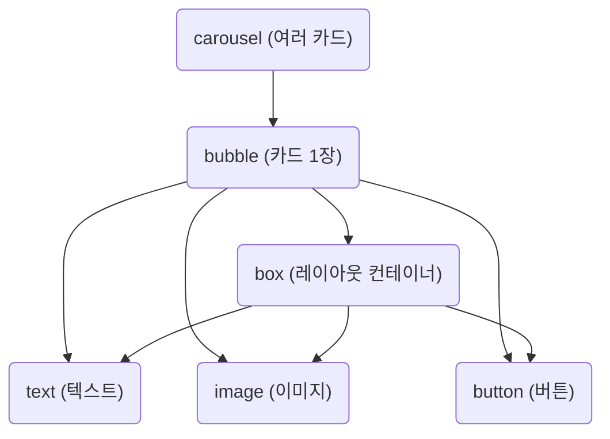

# Flexible Message JSON 사용법 (실무 문서 예시)
## 개요
> 네이버웍스 Flexible Message와 동일하게,
UI를 JSON 트리 구조로 설계하고,
각 요소별 타입(type) 및 속성값을 채우면
동적으로 메시지 화면을 구현할 수 있습니다.

## 1. 전체 구조
Flexible Message는 다음과 같은 트리 구조로 작성합니다.



## 2. 최상위 타입
carousel: 여러 개의 bubble(카드)를 한 번에 보낼 때 사용

bubble: 단일 메시지 카드 (header/body/footer 등 영역 포함 가능)

## 3. 타입별 속성 및 값
아래 표는 각 type별로
필수값/옵션값/사용 가능한 값을 모두 정리한 표입니다.

### 3.1. carousel

|속성|필수/옵션|설명|예시 값|
|--|--|--|--|
|type|필수|"carousel"|"carousel"|
|contents|필수|bubble 배열|[bubble, ...]|

```json
{
  "type": "carousel",
  "contents": [ { ...bubble }, { ...bubble } ]
}
```

### 3.2. bubble
|속성|필수/옵션|설명|예시 값|
|--|--|--|--|
|type|필수|"bubble"|"bubble"|
|header|옵션|상단 영역 (box)|{ ...box }|
|hero|옵션|대표 이미지 (image)|{ ...image }|
|body|필수|본문 영역 (box)|{ ...box }|
|footer|옵션|하단 영역 (box/버튼 등)|{ ...box }|
|styles|옵션|스타일 지정(배경 등)|{ ... }|

```json
{
  "type": "bubble",
  "header": { ...box },
  "hero": { ...image },
  "body": { ...box },
  "footer": { ...box }
}

```

### v3.3. box
|속성|필수/옵션| 설명                      |예시 값|
|--|--|-------------------------|--|
|type|필수| "box"                   |"box"|
|layout|필수| "vertical"/"horizontal" |"vertical"|
|contents|필수| 포함 요소 배열                |[Element, ...]|
|spacing|옵션| 요소간 간격 ("sm"/"md"/"lg") | "md"                   |
|justifyContent|옵션| 가로정렬                   | "center", "start"       |
|alignItems|옵션| 세로정렬                    | "center", "end"         |
|margin/padding|옵션|여백(px 단위)|"8px 0 0 0"|
|style|옵션|추가 스타일|{ ... }|

```json
{
  "type": "box",
  "layout": "vertical",
  "spacing": "md",
  "contents": [
    { "type": "text", "text": "..." },
    { "type": "image", "url": "..." }
  ]
}
```

### 3.4. text
|속성|필수/옵션|설명|예시 값|
|--|--|--|--|
|type	|필수	|"text"	|"text"|
|text	|필수	|실제 표시 문자열	|"회의명"|
|size	|옵션	|"xs"/"sm"/"md"/"lg"/"xl"	|"lg"|
|weight	|옵션	|"bold"/"regular"/"light"	|"bold"|
|color	|옵션	|HEX 또는 컬러명	|"#333"|
|align	|옵션	|"left"/"center"/"right"	|"center"|
|wrap	|옵션	|줄바꿈 여부	|true/false|
|margin	|옵션	|여백(px, 예: "8px 0 0 0")	|"md"|
|style	|옵션	|추가 스타일	|{ ... }|

```json
{
  "type": "text",
  "text": "회의명",
  "size": "lg",
  "weight": "bold",
  "color": "#222",
  "align": "center"
}
```

### 3.5. image
| 속성           | 필수/옵션 | 설명                         | 예시 값           |
| ------------ | ----- | -------------------------- | -------------- |
| type         | 필수    | "image"                    | "image"        |
| url          | 필수    | 이미지 URL                    | "https\://..." |
| aspectRatio  | 옵션    | "1:1", "16:9" 등            | "1:1"          |
| size         | 옵션    | "xs"/"sm"/"md"/"lg"/"full" | "sm"           |
| borderRadius | 옵션    | "50%"(원형), px 단위           | "50%", 8       |
| align        | 옵션    | "center"/"start"/"end"     | "center"       |
| margin       | 옵션    | 여백                         | "md"           |
| style        | 옵션    | 추가 스타일                     | { ... }        |

```json
{
  "type": "image",
  "url": "https://...",
  "aspectRatio": "1:1",
  "size": "sm",
  "borderRadius": "50%",
  "align": "center"
}
```

### 3.6. button
| 속성     | 필수/옵션 | 설명                    | 예시 값          |
| ------ | ----- | --------------------- | ------------- |
| type   | 필수    | "button"              | "button"      |
| action | 필수    | 버튼 액션 객체              | { ...action } |
| style  | 옵션    | "primary"/"secondary" | "primary"     |
| height | 옵션    | "sm"/"md"/"lg"        | "md"          |
| margin | 옵션    | 여백                    | "md"          |
| style  | 옵션    | 추가 스타일                | { ... }       |


#### action 속성
| action 속성 | 필수/옵션 | 설명              | 예시 값                                     |
| --------- | ----- | --------------- | ---------------------------------------- |
| type      | 필수    | "uri"/"message" | "uri"                                    |
| label     | 필수    | 버튼에 표시할 문자열     | "회의시작"                                   |
| uri       | 옵션    | 이동할 링크          | "[https://naver.com](https://naver.com)" |


```json
{
  "type": "button",
  "action": {
    "type": "uri",
    "label": "홈으로",
    "uri": "https://naver.com"
  },
  "style": "primary",
  "height": "md"
}

```

## 4. 예시 템플릿
   [회의 예약 상세]
   ```json
   {
  "type": "bubble",
  "body": {
    "type": "box",
    "layout": "vertical",
    "spacing": "md",
    "contents": [
      { "type": "text", "text": "Meeting Reservation", "weight": "bold", "size": "xl", "align": "center", "margin": "md" },
      {
        "type": "box",
        "layout": "vertical",
        "margin": "lg",
        "spacing": "sm",
        "contents": [
          { "type": "box", "layout": "horizontal", "contents": [ { "type": "text", "text": "회의명", "color": "#888", "size": "sm", "flex": 2 }, { "type": "text", "text": "My Data 기반 AI 비서 서비스 프로젝트 디자인 리뷰", "size": "sm", "flex": 5 } ] },
          { "type": "box", "layout": "horizontal", "contents": [ { "type": "text", "text": "회의실", "color": "#888", "size": "sm", "flex": 2 }, { "type": "text", "text": "R2 5-6 회의실 (12석)", "size": "sm", "flex": 5 } ] },
          { "type": "box", "layout": "horizontal", "contents": [ { "type": "text", "text": "예약자", "color": "#888", "size": "sm", "flex": 2 }, { "type": "text", "text": "X0162468", "size": "sm", "flex": 5 } ] },
          { "type": "box", "layout": "horizontal", "contents": [ { "type": "text", "text": "예약시간", "color": "#888", "size": "sm", "flex": 2 }, { "type": "text", "text": "2025-07-30 14:00  ~ 2025-07-30 15:00", "size": "sm", "flex": 5 } ] }
        ]
      }
    ]
  },
  "footer": {
    "type": "box",
    "layout": "vertical",
    "spacing": "sm",
    "contents": [
      { "type": "button", "action": { "type": "message", "label": "회의시작" }, "style": "primary", "height": "md" },
      { "type": "button", "action": { "type": "message", "label": "예약취소" }, "style": "secondary", "height": "md" }
    ]
  }
}

   ```
## 5. 작성 시 참고/유의사항
type은 반드시 문자열로 명확히 기입

필수값 누락 시 해당 요소가 렌더링되지 않음

각 속성값은 반드시 표에 정의된 값(허용값)만 사용

flex, margin, align 등은 표준 flexbox 속성과 동일

컬러는 HEX 코드, CSS color명 둘 다 가능

이미지 URL은 반드시 https로 시작

action의 uri, label 등은 모두 반드시 채워야함(빠지면 미동작)

## 6. 자주 묻는 질문(FAQ)
   Q: bubble 안에 header/body/footer/hero 모두 넣어야 하나요?
   → A: body만 필수, 나머지는 필요할 때만 넣으면 됨

Q: box 안에 text/image/button 섞어서 쓸 수 있나요?
→ A: 네, box의 contents에는 어떤 type이든 배열로 넣을 수 있습니다.

Q: 버튼을 여러개 한 줄에 넣으려면?
→ A: footer에 box를 만들고, layout을 "horizontal"로 해서 button들을 contents 배열에 나란히 넣으세요.

Q: borderRadius, aspectRatio 값 단위는?
→ A: borderRadius는 "50%"(원형) 또는 숫자(px) 가능, aspectRatio는 "16:9", "1:1" 등 문자열로 씁니다.