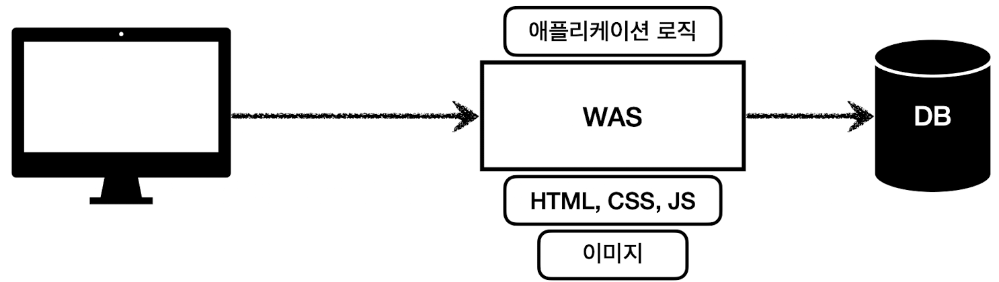
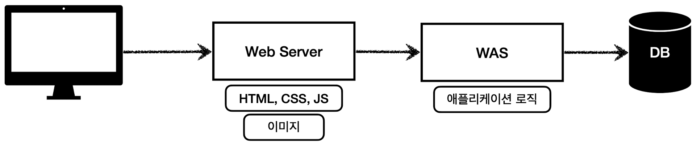
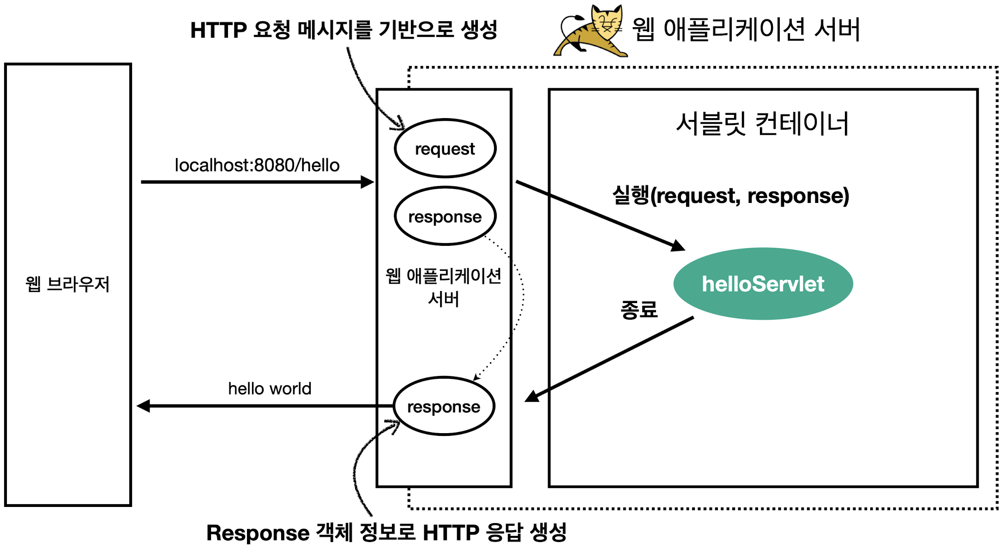
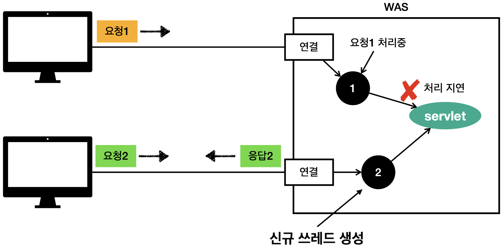
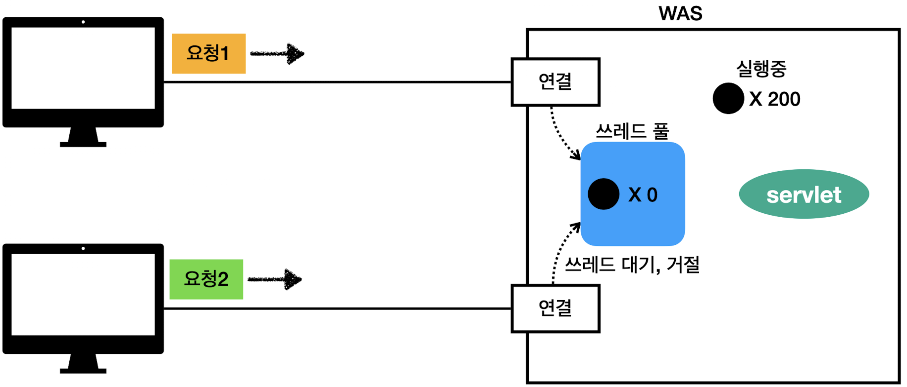

# 웹 서버, 웹 애플리케이션 서버
## Web은 HTTP 기반이다! 모든 것이 HTTP
HTTP 메시지에 모든 것을 전송
- HTML, TEXT
- IMAGE, 음성, 영상, 파일
- JSON, XML (API)
- 서버간에 데이터를 주고 받을 때

등 거의 모든 형태의 데이터 전송 가능 

## Web Server
- HTTP 기반으로 동작 → 클라이언트가 HTTP 요청하면 웹 서버가 HTTP 응답
- 정적 리소스 제공, 기타 부가기능
- 정적 리소스 : 정적 파일 HTML, CSS, JS, 이미지, 영상
- 예) NGINX, APACHE

## WAS - Web Application Server
- HTTP 기반으로 동작 → 클라이언트가 HTTP 요청하면 WAS가 HTTP 응답
- 웹 서버 기능 포함(정적 리소스 제공 가능)
- 프로그램 코드를 실행해서 애플리케이션 로직 수행
    - 동적 HTML, HTTP API(JSON)
    - 서블릿, JSP, 스프링 MVC
- 예) 톰캣(Tomcat), Jetty, Undertow

## 웹 서버 VS 웹 애플리케이션 서버(WAS)
- 웹 서버는 정적 리소스(파일), WAS는 애플리케이션 로직
- 실질적으로 두 용어의 경계가 모호함.
    - 웹 서버도 프로그램을 실행하는 기능을 포함하기는 함.
    - 웹 애플리케이션 서버도 웹 서버의 기능을 제공함.
- 자바는 서블릿 컨테이너 기능을 제공하면 WAS. 
    - BUT, 설블릿 없이 자바코드를 실행하는 서버 프레임워크도 있음. 
- WAS는 애플리케이션 코드를 실행하는데 더 특화.

<br /><br />

# 웹 시스템 구성 
## 1. WAS-DB
- WAS, DB 만으로 시스템 구성 가능
- WAS는 정적 리소스, 애플리케이션 로직 모두 제공 가능 
    - 이 경우 WAS가 너무 많은 역할을 담당(서버 과부하)
    - 가장 비싼 애플리케이션 로직이 정적 리소스 때문에 수행이 어려울 수 있음
    - 오류가 상대적으로 잦게 발생하는 WAS 장애시 오류 화면도 노출 불가능
    

## 2. WEB-WAS-DB(추천)
- 정적 리소스는 웹 서버가 처리
- 웹 서버는 애플리케이션 로직같은 동적인 처리가 필요하면 WAS에 요청을 위임
- WAS는 중요한 애플리케이션 로직 처리 전담
- 정적 리소스 서버와 애플리케이션 로직 서버를 별도로 관리하여 효율적인 리소스 관리
    - 정적 리소스가 많이 사용되면 Web 서버 증설
    - 애플리케이션 리소스가 많이 사용되면 WAS 증설
- 정적 리소스만 제공하는 웹 서버는 잘 죽지 않음. 
- 반면, 애플리케이션 로직이 동작하는 WAS 서버는 상대적으로 오류가 잦아 잘 죽음
- WAS나 DB 장애시 WEB 서버가 오류 화면 제공 가능
    


<br /><br />

# 서블릿
## HTML Form 데이터 전송 시 서버에서 처리해야하는 업무
Post로 데이터 전송 시
```html
    POST /save HTTP/1.1
    Host: localhost:808
    Content-Type: application/x-www-form-urlencoded

    username-kim&age=20
```
```
1. 서버 TCP/IP 연결 대기, 소켓 연결
2. HTTP 요청 메시지를 파싱해서 읽기
3. POST 방식, /save URL 인지
4. Content-Type 확인
5. HTTP 메시지 바디 내용 파싱
    - username, age 데이터를 사용할 수 있게 파싱
6. 저장 프로세스 실행
7. 비즈니스 로직 실행
    - 데이터 베이스에 저장 요청
8. HTTP 응답 메시지 생성 시작
    - HTTP 시작 라인 생성
    - Header 생성
    - 메시지 바디에 HTML 생성해서 입력
         -------------------------------------------
        |    HTTP/1.1 200 OK                        |
        |    Content-Type: text/html;charset=UTF-8  |
        |    Content-Length: 3423                   |
        |                                           |
        |    <html>                                 |
        |        <body>...</body>                   |
        |    </html>                                |
         ------------------------------------------
9. TCP/IP에 응답 전달, 소켓 종료
```

> ☞ 의미있는 비즈니스 로직은 7번 과정 뿐!

### 서블릿을 지원하는 WAS를 사용할 경우
> 비즈니스 로직인 7번 과정 이외의 모든 과정을 (서블릿을 지원하는) WAS가 대신 해 줌!(WAS가 서블릿 컨테이너 역할을 수행)

## 서블릿의 특징
```java
@WebServlet(name = "helloServlet", urlPatterns = "/hello")
public class HelloServlet extends HttpServlet {

    @Override
    protected void service(HttpServletRequest request, HttpServletResponse response){
        // 애플리케이션 로직
    }
}
```
- urlPatterns("/hello")의 URL이 호출되면 서블릿 코드가 실행
- HTTP 요청 정보를 편리하게 사용할 수 있는 `HttpServletRequest`
- HTTP 응답 정보를 편리하게 사용할 수 있는 `HttpServletResponse`

| 개발자는 HTTP 스펙을 매우 편리하게 사용할 수 있음.

## 서블릿 HTTP 요청, 응답 흐름
### HTTP 요청 시


- WAS는 Request, Response 객체를 새로 만들어서 서블릿 객체 호출
- 개발자는 Request 객체에서 HTTP 요청 정보를 편리하게 꺼내서 사용
- 개발자는 Response 객체에서 HTTP 응답 정보를 편리하게 입력
- WAS는 Response 객체에 담겨있는 내용으로 HTTP 응답 정보를 생성

## 서블릿 컨테이너
> 톰캣처럼 서블릿을 지원하는 WAS를 서블릿 컨테이너라고 함.
- 서블릿 컨테이너는 서블릿 객체의 생명주기 관리
- 서블릿 객체는 싱글톤으로 관리 <br />
→ 클라이어트의 요청이 올 때마다 서블릿 객체를 계속 생성하는 것은 비효율적이므로,<br /> 
&nbsp;&nbsp;&nbsp;&nbsp; 최초 로딩 시점에 서블릿 객체를 미리 만들어 주고 재활용.(모든 클라이언트 요청이 동일한 서블릿 객체 인스턴스에 접근)
    - 서블릿 컨테이너 종료시 함께 종료
- JSP도 서블릿으로 변환(java 코드로 변환) 되어서 사용
- 동시 요청을 위한 멀티스레드 처리 지원 - WAS는 서블릿 인스턴스 1개를 가지고 있고, 각 요청마다 새로운 스레드를 만들어서 호출


> **동일한 서블릿 객체이므로 공유 변수 사용 주의** <br />
> 서블릿 객체는 하나지만, 요청 데이터는 공유되지 않음. <br />
> → 요청마다 `HttpServletRequest`, `HttpServletResponse`는 새로 생성되기 때문<br />
> ```java
> public class MyServlet extends HttpServlet {
>   private int count = 0;  // 이건 공유됨 - 위험!
> 
>   @Override
>   protected void doPost(HttpServletRequest request, HttpServletResponse response) {
>       String name = request.getParameter("name"); // 안전 - 요청마다 다름
>       ...    
>   }    
> }
> ```
> - `HttpServletRequest`는 클라이언트 요청마다 서블릿 컨테이너가 새로 만들어서 `doPost()`에 넘겨준다.
> - 즉, 각 클라이언트의 요청은 서로 다른 request 객체를 갖고 있고, 내부에 있는 파라미터나 세션 정보도 분리되어 있어 공유되지 않는다.
> - **단, 인스턴스 멤버 변수는 공유됨**
>   - `private int count;` 같은 인스턴스 필드는 모든 요청이 공유한다.
>   - 멀티스레드 환경에서는 동시에 여러 요청이 들어와 동시 접근 시 문제가 생길 수도 있음.(`Race Condition`)<br />
> &nbsp; ps) `Race Condition` : 여러 스레드가 공유 자원(변수, 객체 등)에 동시에 접근하고 수정할 때, 실행 순서에 따라 결과가 달라질 수 있는 현상.


### 서블릿 컨테이너의 역할
- TCP/IP 연결 대기 및 수신
- HTTP 요청 파싱
- 요청 URL에 맞는 서블릿 매핑
- 서블릿 객체를 생성, 초기화, 호출, 종료하는 생명주기 관리
- `HttpServletRequest`, `HttpServletResponse` 객체 생성
- 요청 데이터 서블릿에 전달(`doGet`, `doPost` 호출)
- 응답 결과를 HTTP 메시지로 변환해서 클라이언트에게 전달

<br /><br />

# 동시 요청 - 멀티스레드
## 스레드(Thread)
- 애플리케이션 코드를 하나하나 순차적으로 실행하는 것은 쓰레드<br />
&nbsp;&nbsp; (자바 메인 메서드를 처음 실행하면 main이라는 이름의 스레드가 실행)
- WAS(톰캣)이 생성한 스레드로 서블릿 객체를 호출함.
- 스레드가 없다면 자바 애플리케이션 실행이 불가능
- 스레드는 한번에 하나의 코드 라인만 수행
- 동시 처리가 필요하면 스레드를 추가로 생성해 줘야함.

### 요청마다 스레드 생성


- 장점
    - 동시 요청을 처리할 수 있다.
    - 리소스(CPU, 메모리)가 허용할 때까지 처리가능
    - 하나의 스레드가 지연 되어도, 나머지 스레드는 정상 동작.
- 단점
    - 스레드는 생성 비용이 매우 비싸다.
        - 고객의 요청이 올 때마다 스레드를 생성하면, 응답 속도가 늦어진다.
    - 스레드는 컨텍스트 스위칭 비용이 발생한다.
    - 스레드 생성에 제한이 없다.
        - 고객 요청이 너무 많이 오면, CPU, 메모리 임계점을 넘어서 서버가 죽을 수 있다.

### 스레드 풀 - 요청마다 스레드 생성의 단점 보완


- 특징
    - 필요한 스레드를 스레드 풀에 보관하고 관리한다.
    - 스레드 풀에 생성 가능한 스레드의 최대치를 관리한다. 톰캣은 최대 200개 기본 설정(변경 가능)
- 사용
    - 스레드가 필요하면, 이미 생성되어 있는 스레드를 스레드 풀에서 꺼내서 사용한다.
    