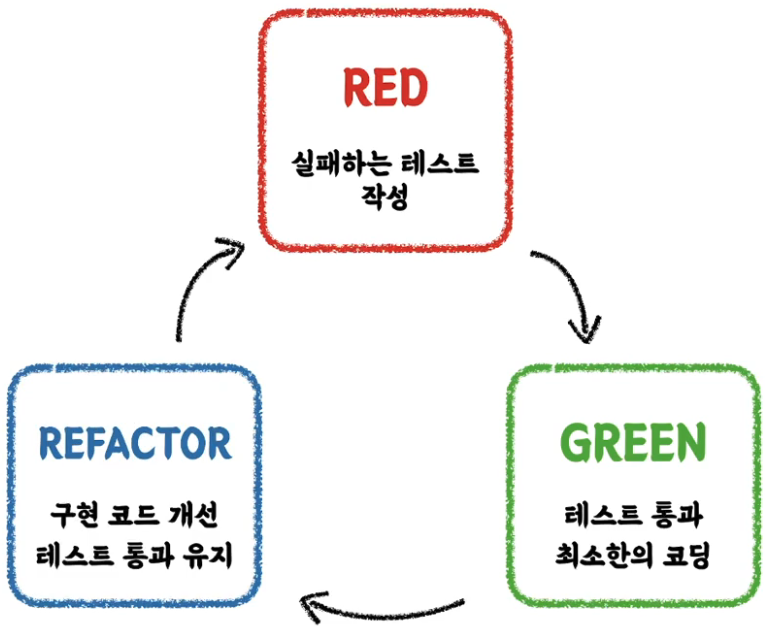

# TDD:Test Driven Development
> 프로덕션 코드보다 테스트 코드를 먼저 작성하여 테스트가 구현 과정을 주도하도록 하는 방법론

- RED : 실패하는 테스트 작성. 구현부가 없으므로 일단 빨간 불을 봐라!
- GREEN : 테스트 통과를 위한 최소한의 코딩. 초록불을 보기위해 주먹구구식으로 막 코딩을 해라!
- REFACTOR : 초록불을 유지하면서 구현한 코드를 개선해라!

## 선 기능 구현 후 테스트 작성 시 문제점
- 테스트 자체의 누락 가능성
- 특정 테스트(ex : 해피 케이스) 케이스만 검증할 가능성이 있다.
- 잘못된 구현을 다소 늦게 발견할 가능성

## 선 테스트 작성 후 기능 구현
- 복잡도가 낮은(= 유연하며 윶비보수가 쉬운) 테스트 가능한 코드로 구현할 수 있게 한다.
- 쉽게 발경하기 어려운 엣지(Edge) 케이스를 놓치지 않게 해준다.
- 구현에 대한 빠른 피드백을 받을 수 있다.
- 과감한 리팩토링이 가능해진다. 

### TDD - `테스트`에 대한 관점의 변화
- 테스트는 
**구현부 검증을 위한 보조 수단**이라는 관점에서
  → **테스트와 상호 작용하며 발전하는 구현부**라는 관점으로 변함
- **클라이언트** 관점에서의 **피드백**을 주는 Test Driven

# 추가 공부
## 애자일(Agile) 방법론(vs 폭포수 방법론)
## 익스트림 프로그래밍(XP, eXtreme Programming)
## 스크럼(Scrum), 칸반(kanban)