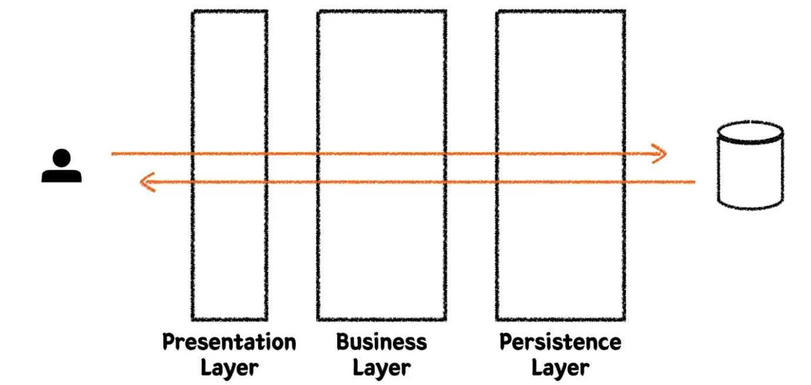
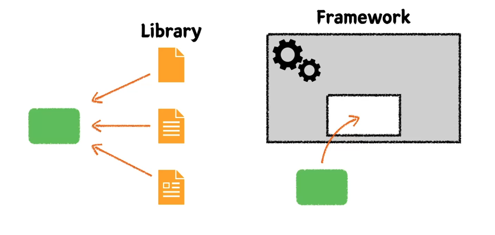
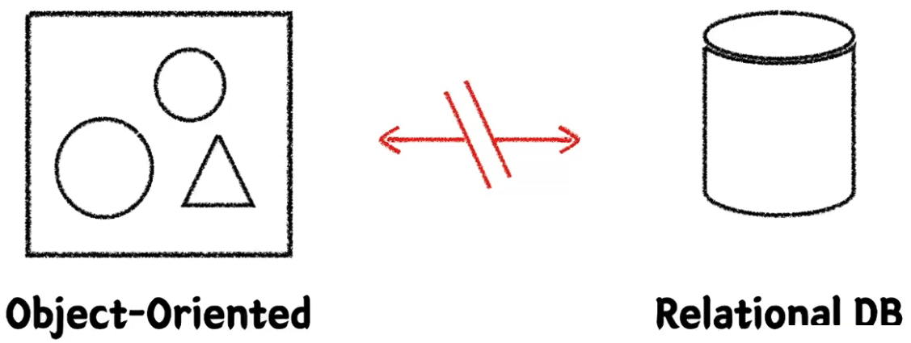
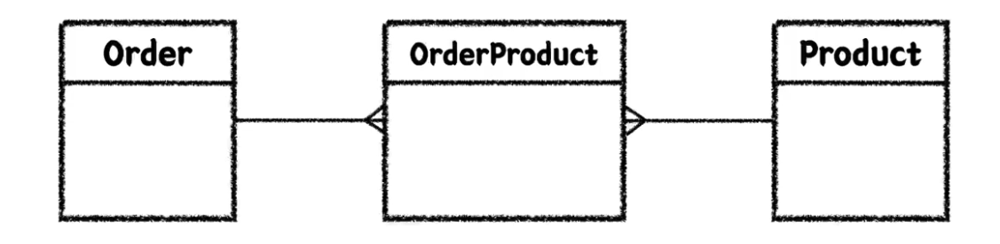

# 레이어드 아키텍처(Layered Architecture)와 테스트
## Layered Architecture

### Layered Architecture를 하는 이유? → 관심사의 분리
**관심사를 분리시켜서 책임을 분산해 유지보수하기 용이하게 해보자!**

## 통합 테스트
A 모듈 + B 모듈인 경우 어떻게 테스트를 해야하는가?  
각각 A, B 단위 테스트로만은 완벽한 테스트가 불가능한 경우 통합 테스트 필요

- 여러 모듈이 협력하는 기능을 통합적으로 검증하는 테스트
- 일반적으로 작은 범위의 단위 테스트만으로는 기능 전체의 신뢰성을 보장할 수 없다.
- 풍부한 단위 테스트 & 큰 기능 단위를 검증하는 통합 테스트

# Spring
## Library vs Framework

|           | 설명                                                                                                                                                                                   | 예시     |
|-----------|--------------------------------------------------------------------------------------------------------------------------------------------------------------------------------------|--------|
| `Library`   | 개발자의 코드가 주체가 되는 능동적인 환경.   외부에서 가져오는 걸 라이브러리라고 함. - 특정 기능을 수행하는 함수/클래스의 집합으로, 개발자가 필요한 시점에 선택적으로 호출. - 애플리케이션의 흐름은 개발자가 주도하며, 라이브러리는 그 흐름 속 일부로 동작한다.               | React  |
| `Framework` | 이미 갖춰진, 동작할 수 있는 환경이 주어지고  개발자의 코드가 수동적으로 프레임 안에 들어가서 역할을 하게됨. - 애플리케이션의 기본 뼈대(구조)와 실행 흐름을 정의해두며, 개발자가는 정해진 틀에 맞춰 코드를 작성한다. - 제어의 역전(IoC)이 일어나며, 프레임워크가 전체 흐름을 주도하고 개발자의 코드를 호출한다. | Vue.js | 

→ 핵심차이는 **"누가 흐름을 제어하느냐"**, 그리고 __"어느 쪽이 중심인가"__ 이다. 
**라이브러리는 "개발자가 중심", 프레임워크는 "틀이 중심"**

### IoC(Inversion of Control : 제어의 역전)
- 프로그램의 흐름을 개발자가 아닌 프레임워크가 담당하도록 하는 것.
- 제어의 순방향이란 프로그램의 흐름은 당연히 개발자가 주도한다. 
- 제어의 역전이란 이런 제어의 흐름이 역전되었다는 걸 의미
- '내'가 만든 프로그램이 미리 만들어진 공장같은 프레임워크가 있고, 그 프레임워크 안에 '내' 코드가 들어가서 일어부분으로, 톱니바퀴의 하나처럼 동작되는 것
- 프레임워크란 톱니바퀴 하나만 빠져있고 나머지는 만들어져 있는 것잇데 '내'가 톱니바퀴 하나만 만들어서 프레임워크에 키우면 완성되는 것 
→ 이 경우 프레임워크가 메인이 된다 할 수 있음. 
→ 이미 만들어진 거대한 프레임워크가 메인이 되고 '내' 코드는 프레임워크의 일부가 되어서 '제어'라는게 프레임워크 쪽으로 넘어가게 된다. 
→ 따라서 '제어'의 주도구너이 개발자가 아닌 프레임워크 쪽으로 간다.(역전)
- 프레임워크란 톱니바퀴 하나만 빠져있고 나머지는 만들어져 있는 것인데 '내'가 톱니바퀴 하나만 만들어서 프레임워크에 키우면 완성되는 것
A객체로 B객체의 생성주기를 관리한다고 했을 때 A와 B가 너무 강결합이 됨. 해서 약결합으로 분리하게하기 위해
객체의 생명주기라는 관리를 제 3자가 함으로써

### DI(Dependency Injection : 의존성 주입, `3`)
- 필요한 의존성을 내가 직접 생성하는게 아니라 외부에서 주입 받는다.
- 객체 A가 객체 B를 필요로 할 경우(둘이 의존성을 갖고 싶을 경우). 객체 A가 객체 B를 생성해서 사용하는게 아니라 의존성을 주입받고 싶을 경우 
→ 생성자 또는 다른 메소드를 통해 주입받고자 할 경우, 객체 A, B는 주입받는 행위를 서로 할 수 없으니 제 `3`자가 주입을 통해 의존 관계를 맺어줄 수 밖에 없다. 
→ Spring에서는 제 3자의 역할을 Spring Container(Ioc Container)가 하게  된다.(Runtime 시점에 해당 행위가 일어나 객체 결정과 주입이 일어나게 된다.)

> 💡 IOC Container가 객체(Bean)를 직접적으로 생성해주고 생명주기 관리를 해 줌.
> - IOC Container는 객체(Bean)의 생성(new)과 소멸을 해줌으로써 객체(Bean)의 생명주기를 관리해 줌.
> - 추가로 의존성 주입(DI)까지 해줌으로써 개발자는 객체(Bean)의 생성, 소멸, 의존성 주입에 대해 신경쓰지 않고 코드만 작성하면된다.

## AOP(Aspect Oriented Programming : 관점 지향 프로그래밍)
- 애플리케이션의 핵심 로직과 부가적인 기능(횡단 관심사)을 분리하여 모듈화하는 프로그래밍.
- 횡단 관심사는 로깅, 트랜잭션, 권한 인증 등과 같이 여러 기능에 걸쳐 적용되는 공통 기능을 의미.
- 코드의 중복을 없애고 재사용하여 유지보수성을 높이는 데 도움을 준다.

> 💡 DIP(Dependency Inversion Principle : 의존성 역전의 원칙) 
> 고수준 모듈과 저수준 모듈이 직접적으로 의존하는게 아니라 추상화(인터페이스 또는 추상 클래스)라는 매개를 통해 의존되어야 한다.

# JPA
## ORM(Object-Relational Mapping)

- 객체 지향 패러다임과 관계형 DB 패러다임의 불일치
- 이전에는 개발자가 객체의 데이터를 한땀한땀 매핑하여 DB에 저장 및 조회(CRUD)
- ORM을 사용함으로써 개발자는 단순 작업을 줄이고, 비즈니스 로직에 집중할 수 있다.

## JPA(Java Persistence API)
- Java 진영의 ORM 기술 표준
- 인터페이스이고, 여러 구현체가 있지만 보통 Hibernate를 많이 사용한다.
- 반복적인 CRUD SQL을 생성 및 실행해주고, 여러 부가 기능들을 제공한다.
- 편리하지만 쿼리를 직접 작성하지 않기 때문에, 어떤 식으로 쿼리가 만들어지고 실행되는지 명확하게 이해하고 있어야 한다.
- Spring 진영에서는 JPA를 한번 더 추상화한 Spring Data JPA 제공
- QueryDSL과 조합하여 많이 사용한다.(타입체크, 동적쿼리)
- `@Entity`, `@Id`, `@Column`
- `@ManyToOne`, `@OneToMany`, `@OneToOne`, `@ManyToMany`(일대다-다대일 관계로 풀어서 사용)

# 엔티티 설계
다대다 관계인 `Order`과 `Product`를 일대다-다대일 관계로 풀기 위해 `OrderProduct` 추가 

