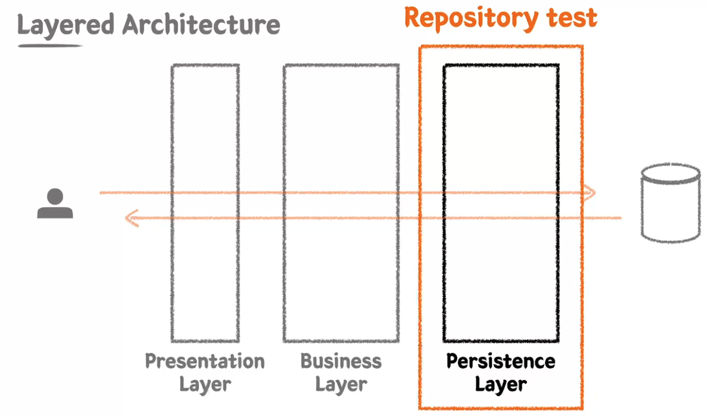
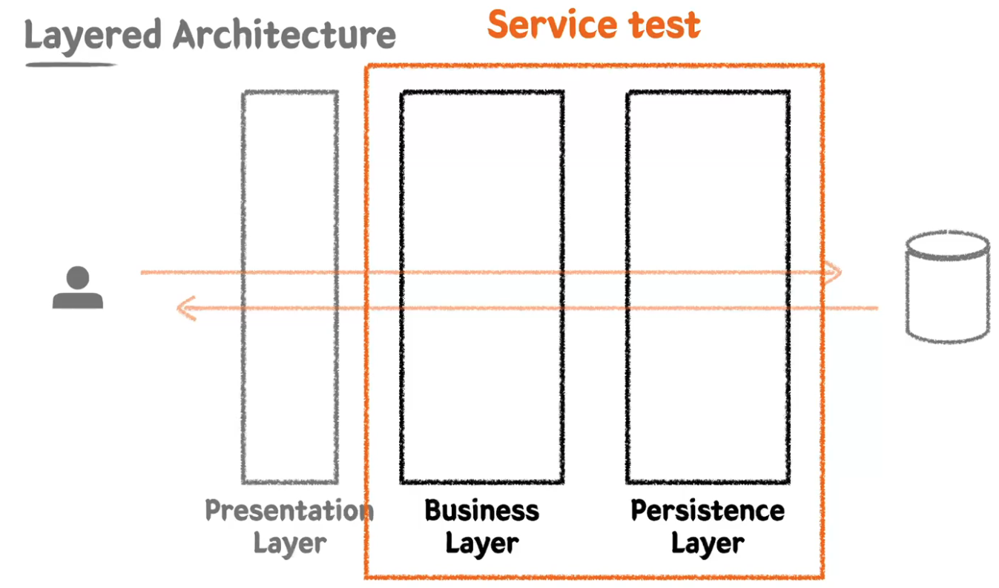
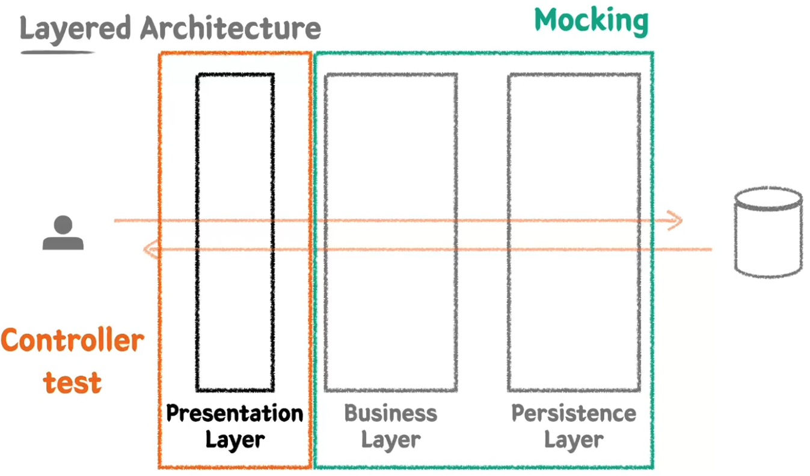
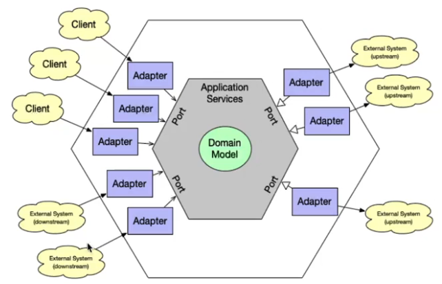

# 레이어드 아키텍처(Layered Architecture)와 테스트
## Layered Architecture


### Layered Architecture를 하는 이유? → 관심사의 분리
**관심사를 분리시켜서 책임을 분산해 유지보수하기 용이하게 해보자!**

## 통합 테스트
A 모듈 + B 모듈인 경우 어떻게 테스트를 해야하는가? <br />
각각 A, B 단위 테스트로만은 완벽한 테스트가 불가능한 경우 통합 테스트 필요

- 여러 모듈이 협력하는 기능을 통합적으로 검증하는 테스트
- 일반적으로 작은 범위의 단위 테스트만으로는 기능 전체의 신뢰성을 보장할 수 없다.
- 풍부한 단위 테스트 & 큰 기능 단위를 검증하는 통합 테스트

# Spring
## Library vs Framework


|           | 설명                                                                                                                                                                                   | 예시     |
|-----------|--------------------------------------------------------------------------------------------------------------------------------------------------------------------------------------|--------|
| `Library`   | 개발자의 코드가 주체가 되는 능동적인 환경. <br /> 외부에서 가져오는 걸 라이브러리라고 함.<br />- 특정 기능을 수행하는 함수/클래스의 집합으로, 개발자가 필요한 시점에 선택적으로 호출.<br />- 애플리케이션의 흐름은 개발자가 주도하며, 라이브러리는 그 흐름 속 일부로 동작한다.               | React  |
| `Framework` | 이미 갖춰진, 동작할 수 있는 환경이 주어지고<br /> 개발자의 코드가 수동적으로 프레임 안에 들어가서 역할을 하게됨.<br />- 애플리케이션의 기본 뼈대(구조)와 실행 흐름을 정의해두며, 개발자가는 정해진 틀에 맞춰 코드를 작성한다.<br />- 제어의 역전(IoC)이 일어나며, 프레임워크가 전체 흐름을 주도하고 개발자의 코드를 호출한다. | Vue.js | 

→ 핵심차이는 **"누가 흐름을 제어하느냐"**, 그리고 __"어느 쪽이 중심인가"__ 이다.<br />
**라이브러리는 "개발자가 중심", 프레임워크는 "틀이 중심"**

### IoC(Inversion of Control : 제어의 역전)
- 프로그램의 흐름을 개발자가 아닌 프레임워크가 담당하도록 하는 것.
- 제어의 순방향이란 프로그램의 흐름은 당연히 개발자가 주도한다. 
- 제어의 역전이란 이런 제어의 흐름이 역전되었다는 걸 의미
- '내'가 만든 프로그램이 미리 만들어진 공장같은 프레임워크가 있고, 그 프레임워크 안에 '내' 코드가 들어가서 일어부분으로, 톱니바퀴의 하나처럼 동작되는 것
- 프레임워크란 톱니바퀴 하나만 빠져있고 나머지는 만들어져 있는 것잇데 '내'가 톱니바퀴 하나만 만들어서 프레임워크에 키우면 완성되는 것<br />
→ 이 경우 프레임워크가 메인이 된다 할 수 있음.<br />
→ 이미 만들어진 거대한 프레임워크가 메인이 되고 '내' 코드는 프레임워크의 일부가 되어서 '제어'라는게 프레임워크 쪽으로 넘어가게 된다.<br />
→ 따라서 '제어'의 주도권이 개발자가 아닌 프레임워크 쪽으로 간다.(역전)
- 프레임워크란 톱니바퀴 하나만 빠져있고 나머지는 만들어져 있는 것인데 '내'가 톱니바퀴 하나만 만들어서 프레임워크에 키우면 완성되는 것
A객체로 B객체의 생성주기를 관리한다고 했을 때 A와 B가 너무 강결합이 됨. 해서 약결합으로 분리하게하기 위해
객체의 생명주기라는 관리를 제 3자가 함으로써

### DI(Dependency Injection : 의존성 주입, `3`)
- 필요한 의존성을 내가 직접 생성하는게 아니라 외부에서 주입 받는다.
- 객체 A가 객체 B를 필요로 할 경우(둘이 의존성을 갖고 싶을 경우). 객체 A가 객체 B를 생성해서 사용하는게 아니라 의존성을 주입받고 싶을 경우<br />
→ 생성자 또는 다른 메소드를 통해 주입받고자 할 경우, 객체 A, B는 주입받는 행위를 서로 할 수 없으니 제 `3`자가 주입을 통해 의존 관계를 맺어줄 수 밖에 없다.<br />
→ Spring에서는 제 3자의 역할을 Spring Container(Ioc Container)가 하게  된다.(Runtime 시점에 해당 행위가 일어나 객체 결정과 주입이 일어나게 된다.)

> 💡 IOC Container가 객체(Bean)를 직접적으로 생성해주고 생명주기 관리를 해 줌.
> - IOC Container는 객체(Bean)의 생성(new)과 소멸을 해줌으로써 객체(Bean)의 생명주기를 관리해 줌.
> - 추가로 의존성 주입(DI)까지 해줌으로써 개발자는 객체(Bean)의 생성, 소멸, 의존성 주입에 대해 신경쓰지 않고 코드만 작성하면된다.

## AOP(Aspect Oriented Programming : 관점 지향 프로그래밍)
- 애플리케이션의 핵심 로직과 부가적인 기능(횡단 관심사)을 분리하여 모듈화하는 프로그래밍.
- 횡단 관심사는 로깅, 트랜잭션, 권한 인증 등과 같이 여러 기능에 걸쳐 적용되는 공통 기능을 의미.
- 코드의 중복을 없애고 재사용하여 유지보수성을 높이는 데 도움을 준다.

> 💡 DIP(Dependency Inversion Principle : 의존성 역전의 원칙)<br />
> 고수준 모듈과 저수준 모듈이 직접적으로 의존하는게 아니라 추상화(인터페이스 또는 추상 클래스)라는 매개를 통해 의존되어야 한다.

# JPA
## ORM(Object-Relational Mapping)


- 객체 지향 패러다임과 관계형 DB 패러다임의 불일치
- 이전에는 개발자가 객체의 데이터를 한땀한땀 매핑하여 DB에 저장 및 조회(CRUD)
- ORM을 사용함으로써 개발자는 단순 작업을 줄이고, 비즈니스 로직에 집중할 수 있다.

## JPA(Java Persistence API)
- Java 진영의 ORM 기술 표준
- 인터페이스이고, 여러 구현체가 있지만 보통 Hibernate를 많이 사용한다.
- 반복적인 CRUD SQL을 생성 및 실행해주고, 여러 부가 기능들을 제공한다.
- 편리하지만 쿼리를 직접 작성하지 않기 때문에, 어떤 식으로 쿼리가 만들어지고 실행되는지 명확하게 이해하고 있어야 한다.
- Spring 진영에서는 JPA를 한번 더 추상화한 Spring Data JPA 제공
- QueryDSL과 조합하여 많이 사용한다.(타입체크, 동적쿼리)
- `@Entity`, `@Id`, `@Column`
- `@ManyToOne`, `@OneToMany`, `@OneToOne`, `@ManyToMany`(일대다-다대일 관계로 풀어서 사용)

# 엔티티 설계
다대다 관계인 `Order`과 `Product`를 일대다-다대일 관계로 풀기 위해 `OrderProduct` 추가 


>  **추가 요구사항**
> - 키오스크 주문을 위한 상품 후보 리스트 조회하기
> - 상품의 판매 상태 : 판매중, 판매보류, 판매중지<br />
> → 판매중, 판매보류인 상태의 상품을 화면에 보여준다.
> - id, 상품 번호, 상품 타입, 판매 상태, 상품 이름, 가격

## Query Method에 대한 테스트 작성이 필요한 이유
- 사실상 Repository는 단위테스트에 가깝다.
- 쿼리가 간단한 경우에는 예측이 쉽게되어 테스트의 필요성이 없다고 느낄수도 있다.
- where절의 조건이 많아지거나, 파라미터가 많아지거나, QueryDSL를 적용할 경우 구현하는 기술 또는 방법이 변경될 수 있기때문에
  1. 내가 작성한 코드가 제대로된 쿼리가 날라가는지 보장을 위해 
  2. 미래에 어떻게 변경되지 모르기 때문에
  
테스트 작성이 필요하다

# 테스트 작성
## 테스트 관련 어노테이션

- `@SpringBootTest`(선호) : Spring에서 제공하는 통합테스트를 위한 어노테이션
- `@DataJpaTest` : `@SpringBootTest` 보다 가볍고, Jpa와 관련된 bean들만 주입해서 실행함.<br />
안에 `@Transactional`이 있어서 자동으로 Rollback이 되므로 수동으로 만든 객체를 없애지 않아도 다른 테스트에 영향을 주지 않는다.

## assertJ
- `.containsExactly()` : 출력되는 순서까지도 일치하는지 체크
- `.containExactlyInAnyOrder()` : 순서 상관없이 일치하는지 체크

## Persistence Layer
- Data Access의 역할
- 비즈니스 가공 로직이 포함되어서는 안 된다. Data에 대한 CRUD에만 집중한 레이어

### Repository Test


Spring 서버를 띄워서 테스트를 함으로 통합테스트이긴 하지만, 해당 레이어만 테스트하므로 단위 테스트의 성격이 강하다.

## Business Layer
- 비즈니스 로직을 구현하는 역할
- Persistence Layer와의 상호작용(Data를 읽고 쓰는 행위)을 통해 비즈니스 로직을 전개시킨다.
- 트랜잭션을 보장해야 한다.

## Service Test

Business Layer와 FPersistence Layer를 통합해서 테스트 진행.

> **추가 요구사항**
> - 상품 번호 리스트를 받아 주문 생성하기
> - 주문은 주문 상태, 주문 등록 시간을 가진다.
> - 주문의 총 금액을 계산할 수 있어야 한다.
> - 주문 생성 시 재고 확인 및 개수 차감 후 생성하기
> - 재고는 상품번호를 가진다.
> - 재고와 관련 있는 상품 타입은 병 음료, 베이커리이다.

### 문제) OrderServiceTest에서 `@Transactional`
- `OrderServiceTest`에서 `@Transactional`을 지운 상태에서 `createOrderWithStock()`를 테스트 해보니, ERROR!<br />
→ `OrcerService`에 `@Transactional`을 적용하니 ERROR가 안남.
- 테스트 실행시 쿼리 나가는걸 보니 원래 `OrderServiceTest`에 `@Transactional`을 적용하면 update 쿼리가 나가는데 안나감. 근데 `@Transactional`을 적용하니 날라감. 
- 테스트에 `@Transactional`을 적용하면 자동으로 rollback도 되어 만들어진 객체들도 자동으로 클리어 되서 편하지만, 실제 Service에 `@Transactional`이 적용되지 않아도 통과되는 상황이 발생하여 테스틑 통과하였지만, 실제 배포된 환경에서는 에러가 발생할 수 있다.(검증이 제대로 이루어지지 않게 됨)
- 테스트에 `@Transactional`을 아예 쓰지 말자 보다는 이런 문제점이 있다는 걸 팀원 모두가 인지하고 사용하는 걸 권장한다. 

> ✅ `update`쿼리가 안나간 건 `@Transactional`이 적용되지 않아서라는 건 알겠다. <br />
> 근데 왜 `insert` 쿼리는 작동된건 지??
> 
> `JpaRepository`에 기본 구현체(`CrudRepository` - `saveAll()`, `save()`, `delete()` 등)를 따라가보면 해당 메소드에 `@Transactional`이 설정이 다 되어있다.

## Presentation Layer
- 외부 세계의 요청을 가장 먼저 받는 계층
- 파라미터에 대한 최소한의 검증을 수행한다.

### Controller Test


> **추가 요구사항**
> - 관리자 페이지에서 신규 상품을 등록할 수 있다.
> - 상품명, 상품 타입, 판매 상태, 가격 등을 입력받는다.
>

#### 💡 @Transactional(readOnly = true)
- 해당 트랜잭션은 **읽기 전용(read-only)** 모드로 동작합니다.
- 내부적으로 JPA는 **변경 감지(dirty checking)** 를 수행하지 않으며, <br />
엔티티의 상태를 저장하기 위한 **스냅샷(snapshot)** 도 생성하지 않습니다. → 그만큼 **성능이 향상**됩니다.
- 주로 단순 조회(Select)용 서비스에서 사용됩니다. <br />
  ```java
    @Transactional(readOnly = true)
    public List<User> findAllUsers() { ... } 
    ```
 - ✅ CQRS (Command and Query Responsibility Segregation)
   - Command(CUD)와 Query(R) 로직을 분리하는 아키텍처 패턴입니다.
   - 실제로 대부분의 서비스는 **Read 작업이 80~90% 이상** 차지합니다. 
 - ✅ Replication (읽기/쓰기 분리)
   - 마스터 DB(Master 또는 Primary)는 쓰기(CUD) 처리 전용
   - 리플리카 DB(Replica)는 읽기(Read) 처리 전용
   - AWS Aurora 같은 클라우드 DB는 **readOnly 트랜잭션**을 통해 리플리카로 자동 라우팅할 수 있음
   - 이를 통해 DB 부하를 효율적으로 분산시킬 수 있음
 - 즉, JPA 사용하지 않고, DB도 Master/Replica 구분 없이 단일이라면 `readOnly = true` 옵션은 실질적 효용은 없음.

> **💡 Dirty Checking**
> 
> JPA에서 영속성 컨텍스트가 관리하는 엔티티 객체의 값이 변경되었는지를 자동으로 감지하는 기능.
> 이로 인해, JPA는 별도의 update쿼리를 개발자가 명시하지 않아도, 변경된 필드만 자동으로 UPDATE 쿼리를 만들어 줌.
> 예시 :
>   ```java
>   @Transactional
>   public void updateUserName(Long userId, String newName) {
>     User user = userRepository.findById(userId).orElseThrow();
>     user.setName(newName);  // <== 여기서 메모리 상의 필드 값 변경
> 
>     // save() 호출 안 해도, 트랜잭션 커밋 시점에 자동 감지되어 update 쿼리 발생!
>   }
>   ```
> - 내부 동작
>   1. `findById()`로 조회한 엔티티는 영속성 컨텍스트에 저장됨
>   2. 트랜잭션 도중 `setName()` 호출로 객체 상태가 변경됨
>   3. 트랜잭션 커밋 시점에 Hibernate가
>      - 최초 상태(snapshot)와
>      - 현재 상태를 비교해서
>      - 변경된 필드가 있다면 `UPDATE` 쿼리 생성
>

#### Mock
- '가짜', '대역'이라는 의미

#### MockMvc
- 의존관계가 있는 것들로 인해 준비해야 할 것들이 많아서 테스트가 방해된다. 그래서 준비해야 할 것들을 잘 동작된다고 가정하고 '가짜'로 처리해서 `Mock`이라는 단어를 사용한다.
- Mock(가짜)객체를 사용해 스프링 MVC 동작을 재현할 수 있는 테스트 프레임워크
- `@WebMvcTest`와 같이 사용
  - `@SpringBootTest`는 전체 Bean 컨텍스트를 띄우는 어노테이션이였다면, <br />
  - `@WebMvcTest`는 Controller 관련 Bean만 띄울 수 있는 좀 더 가벼운 어노테이션이다.
  - 작성 시 관련 Controller를 명시해주면 됨.
- `@MockitoBean`
  - Spring Context에 해당 타입의 Bean을 Mockito Mock 객체로 등록해 줌.
  - `@WebMvcTest`는 Controller 계층만 테스트할 때 사용하는 슬라이스 테스트로, `@Service`, `@Repository`, `@Component` 등은 자동으로 로딩되지 않음.<br />
  ⇢ 그래서 Controller에서 사용하는 Service는 직접 `@MockBean`으로 등록해줘야 함.

> ✅ Spring Boot 3.4.0부터 `@MockBean` Deprecated
> `@MockBean` → `@MockitoBean`으로 대체
> - `@MockitoBean`의 역할
>   - 테스트 환경에서 애플리케이션 컨텍스트(Application Context)의 빈을 모킹하도록 설정
>   - 주로 `Mockito` 라이브러리와 함께 사용되며, 테스트 시 특정 빈의 동작을 가짜로 대체하고자 할 때 유용
> - `@MockitoBean` 사용 대상
>   - 테스트 클래스의 필드에만 적용 가능
>   - 모킹할 빈은 필드의 타입에서 자동으로 추론되며, 해당 빈이 테스트 컨텍스트에 오버라이드(교체)된다.
> - 어노테이션이 적용된 필드의 타입에 따라 모킹할 빈이 자동으로 선택됨.
> - 빈이 여러개인 경우
>   - `@Qualifier`를 사용해 명시적으로 선택
>   - 필드 이름이 빈 이름으로 사용되어 자동으로 매칭 시도
> - 빈이 존재하지 않는 경우
>   - 빈이 컨텍스트에 없는 경우, 해당 빈이 새롭게 생성되고 모킹
>     - 그러나, 빈이 반드시 존재해야 한다면 `enforceOverride = true` 설정 - 이 경우 빈이 없다면 테스트 실패

- `mockMvc.perform()` : api를 날리게 해 줌.
- `ObjectMapper` : json은 직렬화 / 역직렬화를 도와줌.(역직렬화를 할 때 객체의 기본생성자를 사용하므로 기본생성자가 꼭 있어야한다.)


#### `@Valid`

- gradle에 validation 의존성 추가
  - `@Valid`가 에러나면 `BindException` 에러가 터짐
      ```java
        import org.springframework.http.HttpStatus;
        import org.springframework.validation.BindException;
        import org.springframework.web.bind.annotation.ControllerAdvice;
        import org.springframework.web.bind.annotation.ExceptionHandler;
        import org.springframework.web.bind.annotation.ResponseStatus;

        @ControllerAdvice
        public class ApiControllerAdvice {

            @ResponseStatus(HttpStatus.BAD_REQUEST) // 실제 예외가 발생했을 때 어떤 응답을 줄 것인지 설정.
            @ExceptionHandler(BindException.class)
            public ApiResponse<Object> bindException(BindException e) {
                return ApiResponse.of(
                            HttpStatus.BAD_REQUEST,
                            e.getBindingResult().getAllErrors().get(0).getDefaultMessage()
                    );
            }

        }
      ``` 
    
 ##### String 값 검증시
- String 값의 최소한의 검증(적어도 이건 String이라면 검증해야한다.)
  - `@NotNull` : null이 아니여야 함. String 기준으로 빈 문자열(`""`) 또는 공백이 있는 문자열(`" "`)은 통과됨.
  - `@NotEmpty` : empty(공백 문자열`" "`)가 아니면 다 통과됨. 빈 문자열(`""`)은 통과 못 함.
  - `@NotBlank` : `@NotNull`, `@NotEmpty`를 모두 통과 안 시킴.(공백 X, 빈 문자열 X) - 보통 String 타입에 사용
  

- 그외에 도메인 특성상 적용되는 검증들 → 해당 검증이 책임 분리에 적합한지 고민해보자!
  - 예를 들어, 상품 이름 20자 제한 두는 경우
  - `@Max(20)`으로 제한을 걸 수 있지만, 글자 수를 제한하는게 Controller에서 제한하는게 맞는지?<br />
  - 이게 String 값 전체 특성상 제한되는 공백 또는 빈 문자열 같은 제한인지, 해당 도멘인 특성에만 적용되는 제한인지?<br />
  → 따라서 String 값에 대한 최소한의 검증(ex : `@NotBlank`)만 Controller에서 제한하고,<br />
  도메인 특성상 갖는 글자제한 같은 검증은 Service Layer나 Product 생성하는 시점에서 검증하는 게 더 책임 분리에 적합하다.<br />
ex) '~ServiceRequest' 객체 안에서 20글자 제한 적용

##### Request 객체
- `Layered Architecture`의 가장 좋은 그림은 하위의 Layer가 상위의 Layer를 모르는 상태(의존성 X)
- 현재 controller 패키지에 만든 `OrderCreateRequest`를 Service 단으로 바로 보내서,<br />
  Controller의 DTO를 Service단에서까지 사용하고있다. → DTO를 통해서 Controller와 Service에 의존이 생김

```java
@RequiredArgsConstructor
@RestController
public class OrderController {

    private final OrderService orderService;

    @PostMapping("/api/v1/orders/new")
    public ApiResponse<OrderResponse> createOrder(@Valid @RequestBody OrderCreateRequest request) {
        final LocalDateTime registeredDateTime = LocalDateTime.now();
        return ApiResponse.ok(orderService.createOrder(request, registeredDateTime));
    }
}
```

따라서 Service용 DTO가 필요함.
```java
// OrderController.java
    @PostMapping("/api/v1/orders/new")
    public ApiResponse<OrderResponse> createOrder(@Valid @RequestBody OrderCreateRequest request) {
        final LocalDateTime registeredDateTime = LocalDateTime.now();
        return ApiResponse.ok(orderService.createOrder(request.toServiceRequest(), registeredDateTime));
    }
```

```java
// OrderCreateRequest.java
// 아래 메소드 추가
public OrderCreateServiceRequest toServiceRequest() {
    return OrderCreateServiceRequest.builder()
            .productNumbers(productNumbers)
            .build();
}


```

```java
// OrderCreateServiceRequest.java
@Getter
@NoArgsConstructor
public class OrderCreateServiceRequest {

    private List<String> productNumbers;

    @Builder
    private OrderCreateServiceRequest(List<String> productNumbers) {
        this.productNumbers = productNumbers;
    }
}
```

- 이렇게하면 Controller와 Service의 DTO로 인한 의존 관계가 없어짐.
- 이후 Service 모듈 분리 시 BeanValidation에 대한 부분이 필요없음. <br />
- 만약 계속 Controller의 DTO를 사용했다면 Service에서도 계속 BeanValidation에 부분이 있어서 <br />
Service에서는 'starter-validation'이 필요없음에도 계속 의존성을 가져가야하는 상황이 됨.

# 추가 Keyword
## Hexagonal Architecture


JPA를 그만 사용하고 싶은때 이미 Repository도 `JpaRepository`를 상속받는 등 너무 강결합이 되어있어 분리가 어려운 상황이 됨.<br />
현재 도메인 객체가 하위에 있는 인프라 레이어인 JPA와 너무 강결합이 되어있어 의문이 제기됨.(기술에 대한 강결합이 너무 심히다.)
→ 그래서 생긴게 Hexagonal Architecture.

- 모듈이 처음부터 크다면 Hexagonal Architecture가 적절하다.

## QueryDSL
- 타입체크, 동적쿼리

```java
import java.util.List;

@RequiredArgsConstructor
@Repository
public class ProductApiRepository {

    private final JPAQueryFactory queryFactory;

    public List<Product> findProductsBySellingStatusIn(List<ProductSellingStatus> sellingStatuses){
        return queryFactory
                .selectFrom(QProduct.product)
                .where(
                    QProduct.product.sellingStatus.in(sellingStatuses)
                )
                .fetch();
    }
}
```

## 동시성 문제
### Optimistic Lock(낙관적 락) VS Pessimistic Lock(비관적 락)

## CQRS